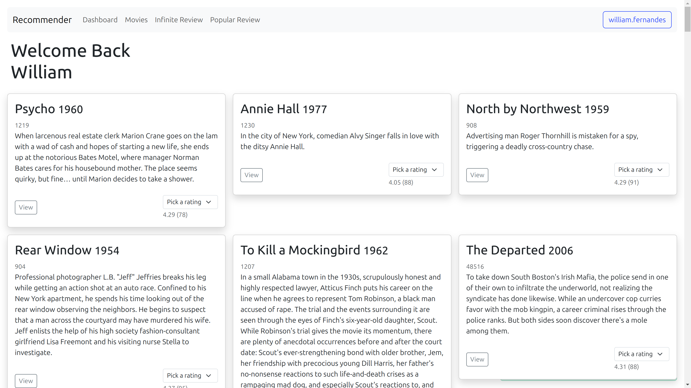

# Movie Recommender

[](./LICENSE)

Web application that recommends movies to users based on their preferences using collaborative filtering and machine learning.



## What is collaborative filtering?

Collaborative filtering is a technique used in recommendation systems to provide personalized suggestions or recommendations to users based on their preferences and behavior, as well as the preferences and behavior of similar users.

The key idea behind collaborative filtering is to leverage the collective wisdom of a large number of users to make recommendations. It works by identifying patterns and similarities among users and items (such as movies, products, or articles) to predict how a user would rate or interact with an item they have not yet encountered.

There are two main types of collaborative filtering:

1. **User-based collaborative filtering**: This approach recommends items to a user based on the preferences of users who are similar to them. It works by first identifying users who have similar tastes or behavior to the target user and then recommending items that those similar users have liked or interacted with. For example, if User A and User B have similar preferences and User A liked a certain movie, User B might be recommended that movie.

2. **Item-based collaborative filtering**: In this approach, recommendations are made based on the similarity between items rather than users. The system analyzes the preferences of users for different items and identifies items that are similar to each other. When a user expresses interest in or interacts with a particular item, the system recommends other items that are similar to it. For instance, if a user likes a particular song, item-based collaborative filtering might suggest similar songs based on shared characteristics like genre, artist, or mood.

Both user-based and item-based collaborative filtering have their strengths and weaknesses. User-based collaborative filtering can suffer from scalability issues as the number of users grows, while item-based collaborative filtering can be computationally expensive due to the need to calculate item similarities.

## How it works?

To generate personalized recommendations from user reviews, the system periodically exports data to a specific format (using libraries such as [Pandas](https://pandas.pydata.org/) and [NumPy](https://numpy.org/) in conjunction with Django's ORM capabilities) and uses it to create models using the Singular value decomposition algorithm (SVD). These models are then used to "predict" the ratings that each user would give to a certain film and, based on these predictions, users are presented with film suggestions: if the algorithm predicts that a user would give a high rating to the movie, the platform he suggests it to her/him.

## Requirements

- Docker and Docker Compose (instalation guide [here](https://docs.docker.com/compose/install/))

## Instalation

In order to install the project locally, run

```bash
# define the compose file
export COMPOSE_FILE=docker-compose.development.yml

# build the containers
docker compose build
```

## Running the app

To run the API in a development environment, execute

```bash
# run the containers
docker compose up
```

now, the resources are available on the [localhost](http://localhost:8000)

## Importing external data

The project contains notebooks to populate the database with movies and movie ratings from [the movies dataset](https://www.kaggle.com/datasets/rounakbanik/the-movies-dataset) available at [Kaggle](https://www.kaggle.com/).

In order to use them, just download the dataset and put files in the expected directories.

## Training machine learning models

There are management commands to help testing models training and the generation of movie recommendations.

If you want to test the recommendation system locally,

1. create some fake users (between 50k and 100k should be enough) to hold the movie ratings with

    ```bash
    docker compose exec -it django python src/manage.py createfakeusers 50000
    ```

1. import the movies data from the dataset to your database by running the [notebooks](./src/notebooks), and [fix the movie to ratings inconsistencies](./src/notebooks/update_ratings_movie_ids.ipynb)

1. export the movie ratings data with

    ```bash
    docker compose exec -it django python src/manage.py exportdatasets
    ```

1. train a machine learning model with

    ```bash
    docker compose exec -it django python src/manage.py trainsurprisemodel
    ```

1. and finally, create suggestions using the trained model by running

    ```bash
    docker compose exec -it django python src/manage.py createmoviesuggestions --offset=25 --max=250
    ```

    Note that this process can take some time to complete and may fail in machines with slower CPUs and little memory. If that is your case, I recommend you to try to limit the number of users covered by the `batch_user_prediction` method [here](./src/movies/tasks.py)

Now, you should be able see the suggestions for your user at the project home page.
